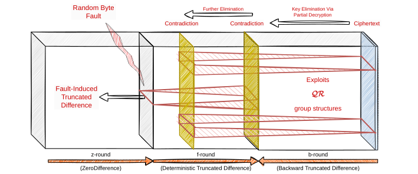

---

Title: "**ToFA**: Towards Fault Analysis of GIFT and GIFT-like Ciphers Leveraging Truncated Impossible Differentials"
Implementation: Shibam Ghosh and Aikata Aikata and Anup Kumar Kundu
Published At: "Transactions on Cryptographic Hardware and Embedded Systems (CHES) Volume 2025 Issue 3"
Full Version:  " https://eprint.iacr.org/2024/1927 "

---
This repository provides supplementary material for our work on the fault analysis of **GIFT** and **GIFT-like** ciphers leveraging truncated impossible differentials.
=========================================================

<p align="center">
  
</p>

## Table of contents

1. [Software Simulation of The Attacks](#simulation)
1. [Attack Realization Using ChipWhisperer Lite](#fault)
&nbsp;

## Software Simulation of The Attacks
The simulation code is given in Gift128/64 and BAKSHEESH are given in respective directories.
To run the simulation, do the following:
```bash
cd cipher_name
make
./byte_fault
```
To change number of Faults, set #define EXP (e.g., for 16 faults #define EXP 16)

## Attack Realization Using ChipWhisperer Lite
